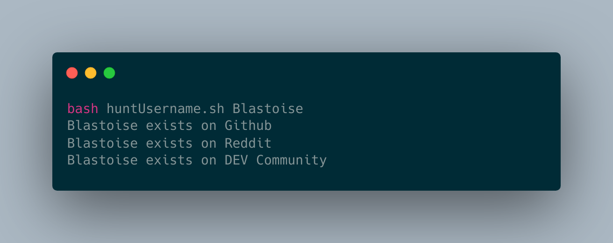

# Hunt Username

Hunt Username is a simple Bash Script that searches for a username on various social channels(Github, Dev.To, Reddit) and then displays whether an account exists with that username.This script can be used for searching for a person on various social channels.

## Dependencies

- cURL

## Setup Instructions

- Installing cURL:

  > sudo apt install curl

- For running the script when we are in the same directory where **huntUsername.sh** resides, execute the following command.

  > bash huntUsername.sh

- For the running script from anywhere regardless of the directory the current user is in, move the file **huntUsername.sh** to **_/usr/local/bin_**.

  1. To do so execute the following command:

     > sudo cp huntUsername.sh /usr/local/bin

  2. Then give execute permission to the script.

     For adding execute permission, run the following command:

     > sudo chmod +x /usr/local/bin/huntUsername.sh

  3. Now you can run the script using the follwing command:

     > huntUsername.sh

## Usage

Using the script is fairly simple, just type the following command if you want to provide the username when prompted:

> bash huntUsername.sh

To provide the username as an argument to the script, run the following command:

> bash huntUsername.sh username

## Output

## Author(s)

**_ Made By [Ashutosh Kumar](https://github.com/Blastoise) _**
